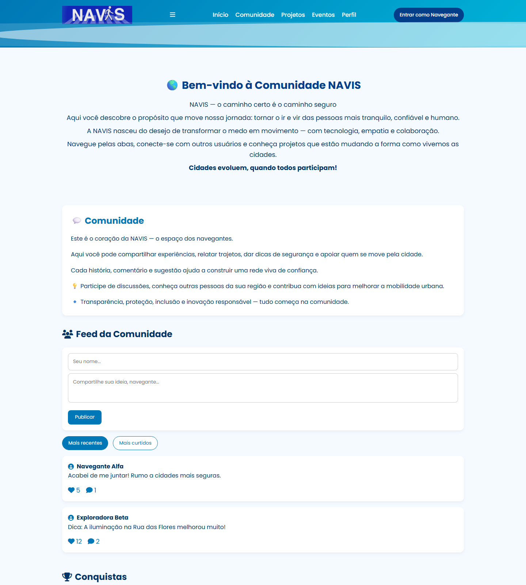

# NAVIS · Comunidade dos Navegantes


-1f2937?style=flat-square&logo=vite&logoColor=white)


Página da comunidade da **NAVIS**, plataforma de geolocalização e segurança que ajuda as pessoas a traçar rotas mais rápidas e seguras.

## Problema e solução

Uma plataforma de rotas seguras depende da participação dos próprios usuários. Esta página cria o espaço de comunidade da NAVIS: apresenta o propósito do projeto, oferece um feed em que os "navegantes" publicam, curtem e comentam, e exibe conquistas (Explorador, Colaborador, Mentor) que incentivam o engajamento.

## Meu papel

Atuei no **marketing e no front-end** da NAVIS. Neste repositório, desenvolvi a página da comunidade: primeiro como protótipo em HTML/CSS/JS puro (`pag_NAVIS/`) e depois migrada para componentes React.

## Decisões de engenharia

- **Migração de HTML estático para React.** A versão original (`pag_NAVIS/corpo.html` + `bot.js`) foi reescrita em componentes: `Header`, `Feed` e `CommentsModal`, compostos em `App.jsx`.
- **Estado local com hooks.** O `Feed` controla posts, filtro e modal com `useState`. A ordenação por "recentes" ou "mais curtidos" é derivada com `useMemo`, sem duplicar estado.
- **Persistência no navegador.** Os posts são salvos e restaurados do `localStorage` (chave `navisPosts`) via `useEffect`, o que permite testar a experiência sem back-end.
- **Comentários em modal.** O `CommentsModal` recebe o post selecionado por props e devolve os novos comentários ao `Feed`.
- **Build com rolldown-vite.** O `package.json` fixa `vite` em `rolldown-vite@7.1.14` via `overrides`.
- **CI.** Todo PR e push na `main` roda `npm run lint` e `npm run build` via GitHub Actions.

## Demonstração



## Como executar

**Pré-requisitos:** Node.js 20+ e npm.

```bash
git clone https://github.com/PlataformaNavis/pag_navegantes.git
cd pag_navegantes
npm install
npm run dev       # servidor de desenvolvimento em http://localhost:5173
npm run lint      # ESLint
npm run build     # build de produção em dist/
npm run preview   # serve o build localmente
```

**Versão estática (protótipo original, sem instalação):** abra `pag_NAVIS/corpo.html` no navegador.

**Testes:** o projeto não possui testes automatizados.

## Estrutura de pastas

```
.
├── index.html            # entrada do Vite (fontes e ícones via CDN)
├── public/               # favicon
├── src/
│   ├── main.jsx          # bootstrap do React
│   ├── App.jsx           # compõe Header, Feed e seções da página
│   ├── Header.jsx
│   ├── Feed.jsx          # posts, filtro e persistência em localStorage
│   ├── CommentsModal.jsx
│   ├── assets/           # logo
│   └── *.css
├── pag_NAVIS/            # protótipo original em HTML/CSS/JS
└── .github/workflows/    # CI: lint + build
```
